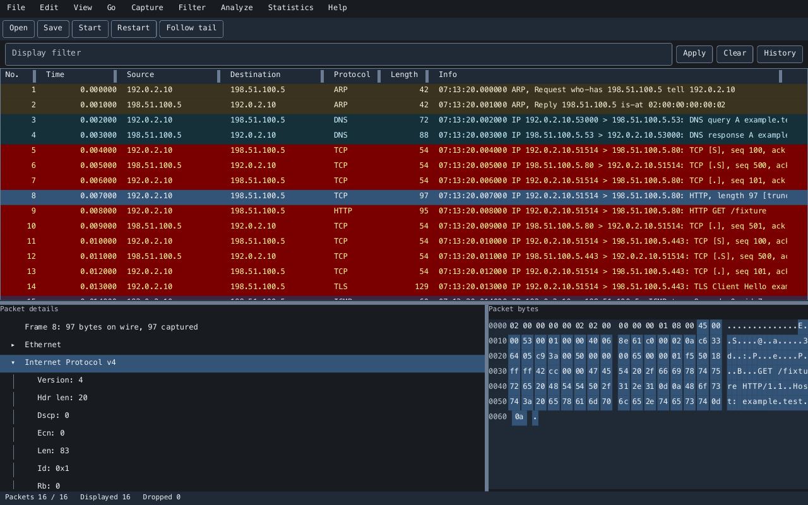

<h1 align="center">Vanken</h1>

<p align="center">
  <strong>A Ruby packet analyzer for live capture, pcap files, and protocol inspection.</strong>
</p>

<p align="center">
  <a href="https://rubygems.org/gems/vanken"></a>
  <a href="https://rubygems.org/gems/vanken"></a>
  <a href="https://github.com/ydah/vanken/actions/workflows/main.yml"></a>
  <a href="vanken.gemspec"></a>
  <a href="LICENSE.txt"></a>
</p>

<p align="center">
  <a href="https://ydah.github.io/vanken/">Website</a> ·
  <a href="https://ydah.github.io/vanken/docs/">User Guide</a> ·
  <a href="#features">Features</a> ·
  <a href="#installation">Installation</a> ·
  <a href="#quick-start">Quick start</a>
</p>

---

Vanken opens pcap and pcapng captures in a desktop or terminal interface, with
a packet list, protocol details, and synchronized byte highlighting. It uses
[redhound](https://github.com/ydah/redhound) for packet analysis and
[Zaniah](https://github.com/noxdea/zaniah) for its interface.

[](https://ydah.github.io/vanken/docs/usage.html)

## Features

- Inspect packets with a sortable virtual list, protocol tree, byte view, and custom field columns.
- Apply typed display filters with completion, history, and bookmarks; search by filter, bytes, text, or regular expression.
- Use coloring rules, marks, ignored packets, time references, and conversation navigation.
- Follow TCP streams, inspect expert diagnostics, and explore protocol hierarchy, conversations, endpoints, and I/O graphs.
- Capture on Linux and macOS with BPF filters, automatic stop conditions, and rotating pcapng files.
- Configure Decode As rules and explicitly trusted Ruby dissector plugins.
- Save pcap/pcapng, export dissections as JSON, NDJSON, text, or CSV, and recover interrupted capture sessions.
- Switch profiles, Japanese or English, and dark, light, system, or high-contrast themes. Optional address resolution runs asynchronously and is disabled by default.

## Installation

Install the released gem:

```sh
gem install vanken
vanken --version
```

Vanken requires Ruby 3.3 or newer. Ruby 3.4 or 4.0 with YJIT is recommended;
the launcher enables YJIT when available. Native Linux windows need the Vulkan
loader and drivers, fonts, and `zenity` for file dialogs. On Ubuntu:

```sh
sudo apt install libvulkan1 mesa-vulkan-drivers fonts-dejavu-core fonts-noto-cjk zenity
```

Linux and macOS support live capture. Windows supports file inspection.
Run Vanken as your normal user. Live capture needs device access or an
administrator-installed helper with a fixed, root-owned runtime. The gem
includes `vanken-setup-permissions` for Linux policies and macOS BPF access;
follow the [capture permissions guide](https://ydah.github.io/vanken/docs/capture-permissions.html)
before installing system permissions.

## Quick start

Open a capture in the desktop interface:

```sh
vanken capture.pcapng
```

Use a real terminal, or print filtered packet columns without a window:

```sh
vanken --tui capture.pcapng
vanken --headless --read capture.pcapng --print-columns --filter 'tcp.port == 443'
```

Select a packet to inspect its fields and bytes. Enter a display filter such as
`tcp.port == 443` or `ip.addr in {192.0.2.0/24, 198.51.100.5}`, then press Enter
in the filter field. Vanken display filters and BPF acquisition filters are
separate languages; see the [filter reference](https://ydah.github.io/vanken/docs/filters.html).

Run `vanken` without a path to open the welcome screen and choose a capture
interface. Ctrl+O opens a file, Ctrl+E starts or stops capture, and Ctrl+Shift+K
opens the command palette. The native macOS window uses Command instead of
Ctrl; the terminal uses Ctrl on both platforms. Tab, Shift+Tab, Enter, and
Escape navigate terminal controls. Run `vanken --help` for all CLI options.

## Configuration and limits

Preferences use safe YAML in the platform's user configuration directory.
Profiles separate preferences, columns, coloring rules, bookmarks, Decode As,
and plugins; recent files and window geometry are shared. Stop capture before
switching profiles or changing dissectors. Plugins execute with your account's
permissions and require explicit trust. See the
[usage guide](https://ydah.github.io/vanken/docs/usage.html) for settings paths,
keyboard controls, stream and export limits, and recovery.

Live acquisition can outpace analysis on slower systems. Captured packets are
stored while queued analysis finishes, but throughput, redraw latency, and
memory targets remain unmet in some measured workloads. See the
[performance guide](https://ydah.github.io/vanken/docs/performance.html) for
handling large captures and understanding the current limits.

## Documentation

- [User Guide](https://ydah.github.io/vanken/docs/)
- [Display filters](https://ydah.github.io/vanken/docs/filters.html)
- [Capture permissions](https://ydah.github.io/vanken/docs/capture-permissions.html)
- [Performance and limits](https://ydah.github.io/vanken/docs/performance.html)
- [Development](https://ydah.github.io/vanken/docs/development.html)
- [Changelog](CHANGELOG.md)

## License

Vanken is released under the [MIT License](LICENSE.txt).
